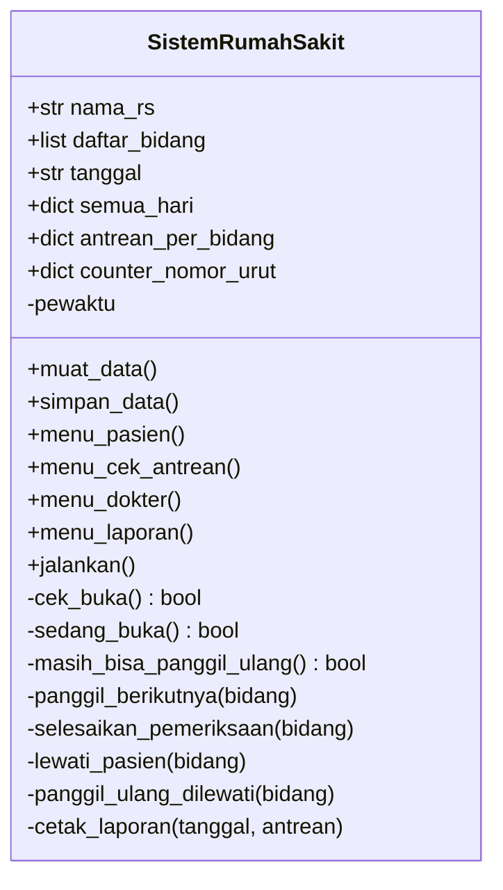

# Sistem Antrean Poliklinik

**Tugas Pemrograman Berorientasi Objek**

| | |
|---|---|
| **Nama** | Abdielnaham d'Revan Zhee |
| **NIM** | 250211060076 |
| **Mata Kuliah** | Pemrograman Berorientasi Objek |
| **Kelas** | E |

---

## Deskripsi

Aplikasi antrean poliklinik berbasis terminal yang ditulis dengan Python murni (tanpa library tambahan). Pasien mendaftar dan mendapat nomor antrean per poli, dokter memanggil pasien dan mengisi hasil pemeriksaan (diagnosis), sedangkan petugas dapat melihat rekap harian beserta nama pasien yang dilewati.

Aplikasi hanya melayani pada jam operasional **08.00 - 20.00**. Di luar jam tersebut semua perintah menampilkan pesan bahwa poliklinik sedang tutup.

## Fitur

**Pasien**
- Pendaftaran dengan nama, umur, poli tujuan, dan keluhan
- Nomor antrean per poli (contoh: `U-001`, `G-003`) dan jumlah antrean di depan
- Cek status antrean: nomor yang sedang dipanggil, posisi antrean, dan info jika dilewati

**Dokter** (dengan PIN)
- Melihat pasien yang menunggu beserta keluhannya
- Memanggil pasien berikutnya
- Menyelesaikan pemeriksaan dengan mengisi **laporan final**: diagnosis (wajib) dan tindakan/resep/catatan (opsional)
- Melewati pasien yang tidak hadir
- Memanggil kembali pasien yang dilewati (maksimal sampai pukul 18.00)

**Petugas** (dengan PIN yang sama)
- Rekap hari ini dan rekap hari tertentu
- Per poli: total pasien, selesai, dilewati, belum terlayani, rata-rata waktu tunggu
- Hasil pemeriksaan (diagnosis) setiap pasien yang selesai
- Daftar nama pasien yang dilewati

**Lainnya**
- Nomor antrean mulai dari 1 lagi setiap hari
- Data tersimpan otomatis dan tetap ada setelah program ditutup
- Penulisan file atomik, dan file rusak dicadangkan otomatis

## Aturan Jam Operasional

| Aturan | Waktu |
|---|---|
| Poliklinik buka | 08.00 |
| Poliklinik tutup | 20.00 |
| Batas memanggil kembali pasien yang dilewati | 18.00 (2 jam sebelum tutup) |

- Di luar 08.00 - 19.59, semua menu (kecuali keluar) menampilkan pesan *"Mohon maaf, poliklinik sedang tutup"*.
- Jika poliklinik tutup saat panel dokter atau panel laporan sedang terbuka, panel langsung ditutup dan pesan yang sama ditampilkan.
- Mulai pukul 18.00, pasien berstatus *dilewati* tidak dapat dipanggil kembali.
- Dokter wajib menyelesaikan pemeriksaan (mengisi diagnosis) atau melewati pasien yang sedang dipanggil sebelum memanggil pasien lain.

## Kebutuhan

- Python 3.8 atau lebih baru
- Tidak ada library tambahan

## Cara Menjalankan

```bash
python antrean_rs.py
```

Di Windows bisa juga memakai `py antrean_rs.py`.

## Contoh Alur

1. Pilih **1. Daftar sebagai Pasien**, isi data, lalu catat nomor antrean yang muncul.
2. Pilih **3. Masuk sebagai Dokter**, masukkan PIN, pilih poli, lalu **Panggil pasien berikutnya**.
3. Setelah pemeriksaan, pilih **Selesaikan pemeriksaan**, isi diagnosis, dan (jika perlu) catatan. Laporan pemeriksaan final akan ditampilkan.
4. Jika pasien tidak hadir, pilih **Lewati pasien sekarang**. Pasien itu bisa dipanggil lagi lewat **Panggil kembali pasien yang dilewati** sampai pukul 18.00.
5. Pilih **4. Laporan & Riwayat (Petugas)** untuk melihat rekap hari ini atau hari tertentu.

Contoh laporan pemeriksaan final:

```
=============================================
      LAPORAN PEMERIKSAAN FINAL
=============================================
No. Antrean : U-002 (Dokter Umum)
Pasien      : Ani (22 tahun)
Keluhan     : Pusing
Diagnosis   : Flu
Catatan     : Paracetamol 3x1
=============================================
```

Contoh pesan di luar jam operasional:

```
=============================================
🏥 MOHON MAAF, POLIKLINIK SEDANG TUTUP
   Jam operasional: 08:00 - 20:00
=============================================
```

## Konfigurasi

| Pengaturan | Default | Keterangan |
|---|---|---|
| PIN dokter dan petugas | `1234` | Ganti lewat environment variable `PIN_DOKTER` |
| Jam buka / tutup | 08:00 / 20:00 | Konstanta `JAM_BUKA` dan `JAM_TUTUP` |
| Batas panggil ulang | 2 jam sebelum tutup | Konstanta `BATAS_PANGGIL_ULANG_JAM` |
| Daftar poli | Umum, Gigi, Mata, Anak, THT | Dictionary `BIDANG_KODE` |
| Batas percobaan PIN | 3 kali | Konstanta `MAKS_PERCOBAAN_PIN` |

Contoh mengganti PIN:

```bash
# Linux / macOS
PIN_DOKTER=987654 python antrean_rs.py

# Windows (PowerShell)
$env:PIN_DOKTER="987654"; python antrean_rs.py
```

## Penerapan Konsep OOP

Seluruh logika aplikasi dibungkus dalam kelas `SistemRumahSakit`.

| Konsep | Penerapan dalam kode |
|---|---|
| **Class dan Object** | Kelas `SistemRumahSakit` dibuat menjadi objek `rs = SistemRumahSakit("NYANDATAU")` |
| **Constructor** | `__init__` menyiapkan nama poliklinik, daftar poli, penyedia waktu, dan memuat data dari file |
| **Atribut** | `nama_rs`, `daftar_bidang`, `tanggal`, `semua_hari`, `antrean_per_bidang`, `counter_nomor_urut` |
| **Enkapsulasi** | Method internal diawali `_` (misalnya `_cek_buka`, `_normalisasi_hari`) dan data hanya diubah lewat method kelas |
| **Abstraksi** | `jalankan()` menyembunyikan detail menu, validasi, dan penyimpanan dari pemanggil |
| **Static method** | `_input_angka`, `_kode_antrean`, `_baca_json`, `_selisih_menit` tidak membutuhkan state objek |
| **Dependency injection** | Parameter `pewaktu` (default `datetime.now`) memungkinkan waktu diganti saat pengujian |
| **Docstring** | Setiap method utama punya penjelasan singkat |

### Diagram Kelas



## Penyimpanan Data

Semua data disimpan dalam satu file `data/antrean.json` yang berisi seluruh hari. Struktur singkatnya:

```json
{
    "hari": {
        "2026-09-30": {
            "antrean": {
                "Dokter Umum": [
                    {
                        "nomor_urut": 1,
                        "nama": "Budi",
                        "umur": 30,
                        "keluhan": "Batuk",
                        "status": "selesai",
                        "waktu_daftar": "10:00:00",
                        "waktu_dipanggil": "10:05:00",
                        "diagnosis": "Bronkitis",
                        "catatan_dokter": "Istirahat dan banyak minum",
                        "waktu_selesai": "10:20:00"
                    }
                ]
            },
            "counter": { "Dokter Umum": 1 }
        }
    }
}
```

Status pasien: `menunggu`, `dipanggil`, `selesai`, `dilewati`.

Catatan:
- Rekap hari lain dilihat lewat menu, jadi file JSON tidak perlu dibuka manual.
- Jika `data/antrean.json` rusak, program memulai data baru dan menyimpan salinan file lama sebagai `data/antrean_rusak_<waktu>.json`.
- Jika ada file lama `data_antrean*.json` (versi sebelumnya) di folder program, isinya dipindahkan otomatis sekali saja dan file lama boleh dihapus.
- Data lama yang belum memiliki diagnosis tetap dapat dibaca; diagnosisnya ditampilkan sebagai `-`.

## Struktur Proyek

```
.
├── antrean_rs.py     # seluruh aplikasi
├── README.md
└── data/
    └── antrean.json  # dibuat otomatis saat ada pasien mendaftar
```

## Privasi dan Keamanan

File data berisi nama, umur, keluhan, dan diagnosis pasien.

- Jangan menaruh folder `data/` di repositori publik. Jika memakai Git, tambahkan `data/` ke `.gitignore`.
- Ganti PIN default `1234` sebelum digunakan.
- PIN hanya pengaman sederhana untuk penggunaan terminal, bukan autentikasi penuh, dan data di file JSON tidak dienkripsi.

## Batasan Saat Ini

- Dirancang untuk satu komputer dan satu pengguna pada satu waktu. Menjalankan dua instance sekaligus dapat menyebabkan data saling menimpa.
- Belum ada fitur pembatalan antrean oleh pasien.
- Pasien yang masih menunggu saat poliklinik tutup tidak dipindahkan ke hari berikutnya dan dihitung sebagai belum terlayani.
- Waktu dicatat sebagai jam saja (`HH:MM:SS`).

## Pengembangan Selanjutnya

- Memecah kode menjadi beberapa kelas (`Pasien`, `Poliklinik`, `Laporan`) dan menerapkan pewarisan serta polimorfisme
- Pembatalan antrean oleh pasien
- Prioritas pasien (lansia, ibu hamil, darurat)
- Ekspor rekap ke CSV
- Mengganti JSON dengan SQLite
- Antarmuka web (Flask atau FastAPI)
